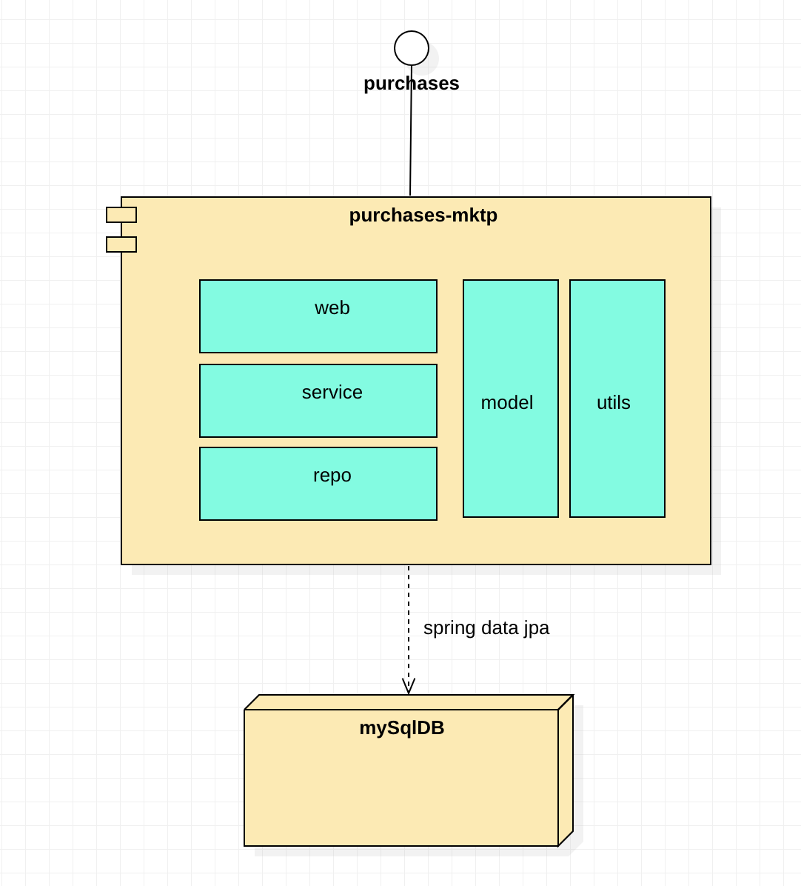

# Microservices and docker

This repo is the foundation of the following application

** General component diagram **

This version uses: spring boot 2.7.1, spring data jpa, java 11 and gradle 7.4.1

Regarding docker, you will find the multi-stage docker file and docker compose yaml file. In future releases, the mysql database will be part of the docker compose file with migrations. Since the database is also a docker container (separately), this version uses docker network to connect between containers.

The current code coverage is 50% using Jacoco library.